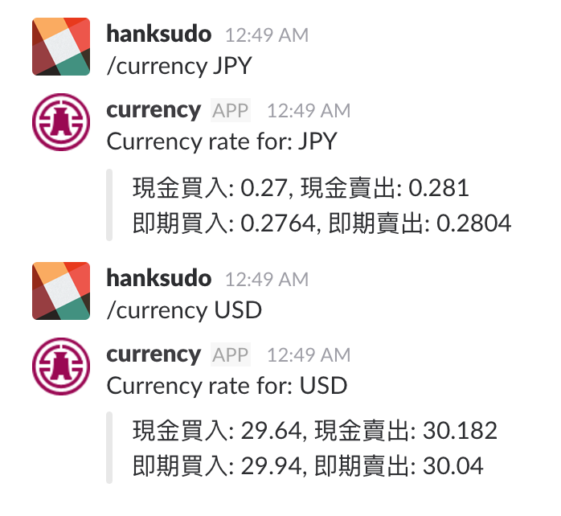

# bot-currency

Currecny rate from BOT (Bank Of Taiwan)

## Features

- Download currency rate file from BOT
- Periodically download new currency rate CSV file.
- Periodically backup to dropbox.
- Use [Slack Slash commands](https://api.slack.com/interactivity/slash-commands) to get latest currency rate



## Installation

```bash
go install github.com/hanksudo/bot-currency@latest
```

## Usage

```bash
# start web server for Slack
bot-currency -web

# Retrieved latest CSV file immediately
bot-currency -renew

# Backup to dropbox
export DROPBOX_ACCESS_TOKEN=<YOUR-ACCESS-TOKEN>
bot-currency -backup
```

## Test slack command on local environment

```bash
go run bot-currency.go -web
ngrok http 3030
```

Then set your ngrok url on you slack command integration url.
